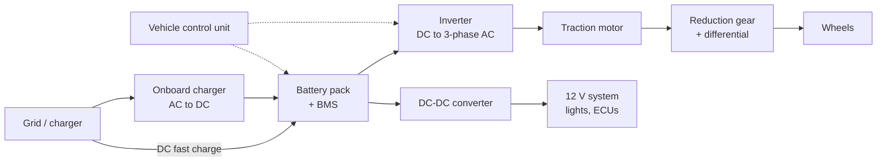
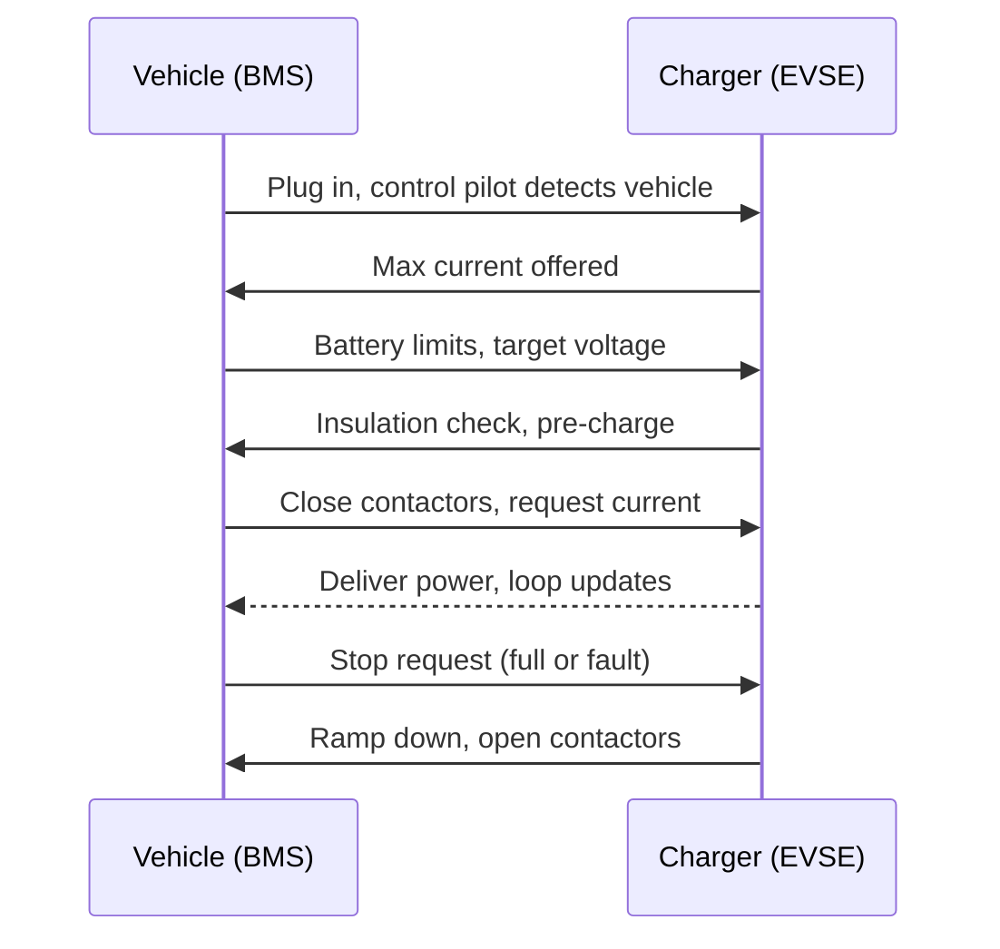
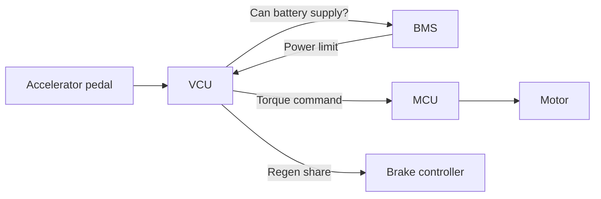

# EV Engineering Handbook: From First Principles to Shop-Floor Practice

2026-09-17 · @Someone

## 0. How to use this handbook

Read this top to bottom once, then keep it open as a reference. It gives you the vocabulary, the mental models and the rules of thumb an entry-to-mid-level electric vehicle (EV) engineer uses daily.

**The problem it solves.** Most EV material is either marketing (range, 0 to 100 time) or deep academic papers. Neither tells you how the parts talk to each other, what fails in the field, or which regulation stops a vehicle from being sold. This handbook sits in the middle.

**What it will not do.** Reading alone will not make you an engineer. It makes you fluent enough to join design reviews, read a specification, question a supplier and learn fast on the job. Section 15 lists the hands-on work that closes the gap.

**Reading order.**

1. Sections 1 and 2: the physics and the vehicle types. Everything else builds on these.
2. Sections 3 to 8: one major subsystem per section. Read the battery section twice; it drives cost, safety and range.
3. Sections 9 to 11: how vehicles are built, certified and kept safe.
4. Section 12: do the worked calculations with a pen. This is where the concepts stick.
5. Section 13: the glossary. Every short form in this document is also expanded on first use.
6. Section 14: the assumptions you should check before relying on any number here.

**A note on numbers.** Figures here are typical engineering ranges from my own teaching and industry knowledge, not values pulled from one source document. Treat them as starting points. Always confirm against the supplier datasheet or the current version of the standard.

## 1. Physics and electrical fundamentals

An EV is an energy-conversion chain: chemical energy in cells becomes electrical energy, then magnetic force in a motor, then torque at the wheels. Every design question reduces to how much energy, how fast (power), and how much is lost as heat.

### 1.1 The five quantities you use every day

| Quantity | Symbol and unit | Plain meaning | EV example |
| --- | --- | --- | --- |
| Voltage | V, volt | Electrical "pressure" pushing charge | A car pack runs at about 350 to 800 V |
| Current | I, ampere (A) | Rate of charge flow | 200 A during hard acceleration |
| Power | P, watt (W) or kilowatt (kW) | Rate of energy use: P = V x I | 400 V x 250 A = 100 kW |
| Energy | E, watt-hour (Wh) or kilowatt-hour (kWh) | Power sustained over time | A 30 kWh pack delivers 30 kW for one hour |
| Resistance | R, ohm | Opposition to current; causes heat | Heat loss = I squared x R |

**Why high voltage matters.** For the same power, doubling voltage halves current. Heat loss scales with current squared, so it drops to a quarter. That is why premium cars moved from 400 V to 800 V: thinner cables, less heat, faster charging.

### 1.2 Charge capacity and C-rate

- **Ampere-hour (Ah):** how much charge a cell holds. A 100 Ah cell supplies 100 A for one hour, in theory.
- **Energy of a cell or pack:** kWh = nominal voltage x Ah / 1000.
- **C-rate:** current expressed relative to capacity. 1C on a 100 Ah cell is 100 A; 2C is 200 A; 0.5C is 50 A. Higher C-rate means faster charge or discharge and more heat and stress.

### 1.3 Direct current and alternating current

- **Direct current (DC):** flows one way. Batteries store and supply DC.
- **Alternating current (AC):** reverses direction many times a second (50 hertz (Hz) in India). The grid supplies AC.
- Most traction motors run on three-phase AC. So the vehicle must convert battery DC into variable-frequency AC. The inverter does this (Section 4).

### 1.4 Road load: what the motor must overcome

Total force at the wheels = rolling resistance + aerodynamic drag + climbing force + acceleration force.

| Force | Formula | What drives it |
| --- | --- | --- |
| Rolling resistance | Crr x m x g | Tyre design and vehicle mass. Crr is about 0.008 to 0.015 |
| Aerodynamic drag | 0.5 x air density x Cd x A x v squared | Shape (Cd), frontal area (A), and speed squared |
| Gradient (climbing) | m x g x sin(angle) | Mass and slope |
| Acceleration | m x a (plus rotating inertia) | Mass and how hard you accelerate |

m = mass (kg), g = 9.81 m/s squared, v = speed (m/s), Cd = drag coefficient, A = frontal area (square metres).

**Three lessons from these equations.**

1. Drag power rises with speed cubed. Highway range is always worse than city range.
2. Mass hurts in city driving (stop-start) far more than on the highway.
3. For two-wheelers and three-wheelers at low speed, rolling resistance and mass dominate; aerodynamics matters less.

### 1.5 Torque, speed and power

- **Torque (newton-metre, Nm):** twisting force. It gives launch and hill-climbing ability.
- **Speed (revolutions per minute, rpm):** how fast the shaft turns.
- **Power (kW) = torque (Nm) x speed (rpm) / 9549.**
- A gearbox trades speed for torque. An 8:1 reduction multiplies torque about 8 times (minus losses) and divides speed by 8.

### 1.6 Efficiency and the loss chain

Typical battery-to-wheel efficiency is about 80 to 90 percent. Losses sit in the battery (internal resistance), inverter (switching), motor (copper, iron and friction losses), gearbox, and auxiliaries such as air-conditioning. Grid-to-wheel adds charger losses of roughly 5 to 15 percent.

### 1.7 Regenerative braking

When the driver lifts off or brakes, the motor runs as a generator. It turns kinetic energy back into electricity and charges the battery. In city traffic this can recover a meaningful share of braking energy. Limits: a full or very cold battery cannot accept much charge, so friction brakes must always be ready.

### 1.8 Electromagnetism in one paragraph

A current in a wire creates a magnetic field. A wire carrying current inside a magnetic field feels a force. Motors use the second effect to create torque; generators use the reverse (moving a conductor through a field creates voltage). Back-EMF (back electromotive force) is the voltage a spinning motor generates against its supply. It rises with speed, which is why a motor runs out of torque at high speed unless the controller weakens the field.

## 2. Vehicle architectures

Four families exist, and they differ in one thing: where the energy comes from and how much the electric side does.

| Type | Full form | Energy source | Plugs in? | Engine? | Where you see it in India |
| --- | --- | --- | --- | --- | --- |
| BEV | Battery electric vehicle | Battery only | Yes | No | Most e-2Ws, e-3Ws, e-buses, cars such as Nexon EV |
| HEV | Hybrid electric vehicle | Fuel; small battery recharged by engine and braking | No | Yes | Strong hybrids such as Hyryder, City e:HEV |
| PHEV | Plug-in hybrid electric vehicle | Larger battery plus engine | Yes | Yes | Rare in India so far |
| FCEV | Fuel cell electric vehicle | Hydrogen converted to electricity on board | Refuels hydrogen | No | Pilots in buses and trucks |

(e-2W = electric two-wheeler; e-3W = electric three-wheeler.)

### 2.1 Hybrid sub-types

- **Mild hybrid (MHEV, mild hybrid electric vehicle):** 12 V or 48 V starter-generator assists the engine. Cannot drive on electricity alone.
- **Series hybrid:** engine only charges the battery; wheels are always driven by the motor.
- **Parallel hybrid:** engine and motor can both drive the wheels.
- **Series-parallel (power-split):** combines both through a planetary gear set. Toyota's system is the classic example.

### 2.2 The BEV block diagram

Solid arrows carry power; dotted arrows carry control signals. BMS = battery management system. ECU = electronic control unit.

### 2.3 Drive layouts

- **Central motor:** one motor drives an axle through a differential. Most common.
- **Dual motor (one per axle):** all-wheel drive; better traction and efficiency switching.
- **Hub motor:** motor inside the wheel. Common on e-2Ws; adds unsprung mass, which hurts ride on rough roads.
- **Mid-drive (2W):** motor near the swingarm pivot, drives the rear wheel via chain or belt. Better weight balance than hub.
- **E-axle / 3-in-1:** motor, inverter and gearbox in one housing. Cuts cost, weight and cabling. Now the norm in cars.

### 2.4 India vehicle categories you must know

Indian rules follow the category codes from the Central Motor Vehicles Rules (CMVR).

| Category | What it covers | Typical EV voltage |
| --- | --- | --- |
| L1, L2 | Two-wheelers (L1 low-speed, L2 higher speed) | 48 to 72 V (some up to about 100 V) |
| L5 | Three-wheelers (e-rickshaw is a separate low-speed class) | 48 to 60 V for e-rickshaws; higher for L5 autos |
| M1 | Passenger cars, up to 8 seats plus driver | 300 to 450 V, some 800 V |
| M2, M3 | Buses | 400 to 700 V |
| N1, N2, N3 | Goods carriers, light to heavy | 60 to 700 V depending on size |

India's volume sits in L-category (two- and three-wheelers). Their low-voltage packs (under 60 V DC in many cases) change the safety rules, cost structure and failure modes compared with cars.

## 3. Batteries: cells, chemistry, packs and the BMS

The battery is 30 to 40 percent of an EV's cost and the source of most safety incidents. If you master one subsystem, make it this one.

### 3.1 How a lithium-ion cell works

A cell has four parts: a negative electrode (anode, usually graphite), a positive electrode (cathode, a lithium metal oxide or phosphate), a liquid electrolyte that lets lithium ions move, and a thin porous separator that keeps the electrodes from touching.

- **Discharging:** lithium ions leave the anode, cross the electrolyte to the cathode. Electrons travel the other way through the external circuit, powering the motor.
- **Charging:** the charger pushes ions back into the anode.
- **SEI (solid electrolyte interphase):** a thin film that forms on the anode during the first charges. It protects the cell but slowly thickens over life, consuming lithium. This is a main cause of capacity fade.
- **Lithium plating:** if you charge too fast or too cold, lithium deposits as metal on the anode instead of entering it. Plating permanently cuts capacity and can grow needle-like dendrites that pierce the separator and cause an internal short.

### 3.2 Cathode chemistries compared

| Chemistry | Full form | Cell energy density (Wh/kg, approx.) | Cycle life (approx.) | Thermal safety | Cost | Typical use |
| --- | --- | --- | --- | --- | --- | --- |
| LFP | Lithium iron phosphate | 140 to 180 | 3,000 to 6,000 | Very good | Low | Most Indian e-3Ws, buses, many cars |
| NMC | Lithium nickel manganese cobalt oxide | 200 to 280 | 1,000 to 2,500 | Moderate | Medium to high | Cars, performance 2Ws |
| NCA | Lithium nickel cobalt aluminium oxide | 240 to 280 | 1,000 to 2,000 | Moderate to low | High | Some Tesla models |
| LMFP | Lithium manganese iron phosphate | 160 to 210 | 2,000 to 4,000 | Good | Low to medium | Emerging |
| LTO (anode) | Lithium titanate oxide | 60 to 90 | 10,000+ | Excellent | Very high | Niche fast-charge buses |
| Na-ion | Sodium-ion | 100 to 160 | 2,000 to 4,000 | Good | Potentially low | Early commercial, low-cost 2Ws and storage |

Lead-acid batteries still power many older e-rickshaws. They are cheap but heavy, last only a few hundred cycles, and are being displaced by LFP.

**How to read the trade-off.** LFP gives safety, cost and life; NMC gives range per kilogram. For India's heat, low-cost segments and high daily usage (e-3W fleets), LFP usually wins.

### 3.3 Cell formats

| Format | Description | Strength | Weakness |
| --- | --- | --- | --- |
| Cylindrical (18650, 21700, 4680) | Metal can; number = diameter and length in mm | Cheap, standardised, good heat spread | Many cells and joints per pack |
| Prismatic | Rigid rectangular metal case | Good space use, fewer cells | Swelling must be restrained; heat harder to pull out of the centre |
| Pouch | Soft laminated foil bag | Light, flexible shape | Needs external support; swelling |

### 3.4 Terms you will hear in every battery meeting

- **Nominal voltage:** average cell voltage (LFP about 3.2 V; NMC about 3.6 to 3.7 V).
- **Voltage window:** safe operating range (LFP about 2.5 to 3.65 V; NMC about 2.8 to 4.2 V). Going outside it damages the cell.
- **SOC (state of charge):** fuel gauge, in percent.
- **SOH (state of health):** current capacity versus new, in percent. End of life for vehicles is usually defined at 70 to 80 percent.
- **DOD (depth of discharge):** how much of capacity is used in a cycle. Shallow cycles extend life.
- **Usable versus gross capacity:** makers keep a buffer at top and bottom. A 40 kWh gross pack may offer 36 to 38 kWh usable.
- **Internal resistance (DCIR, direct current internal resistance):** causes voltage sag under load and heat. It rises with age and cold.
- **OCV (open circuit voltage):** voltage at rest. Used to estimate SOC. LFP's flat OCV curve makes SOC estimation hard.
- **Calendar ageing:** degradation while parked. Worse at high temperature and high SOC.
- **Cycle ageing:** degradation from use. Worse at high C-rate, extreme temperatures, and deep cycles.

### 3.5 From cell to pack

**Series and parallel.** Cells in series add voltage; cells in parallel add capacity. Notation "96S2P" means 96 series groups, each of 2 parallel cells.

- 96S with NMC at 3.65 V nominal gives about 350 V.
- 16S with LFP at 3.2 V gives about 51 V, a common 2W and 3W pack.

**Pack hierarchy.**

1. **Cell-to-module-to-pack:** cells grouped into modules, modules into a pack. Easier to service.
2. **Cell-to-pack (CTP):** skips modules. Higher energy density, fewer parts; repair is harder.
3. **Cell-to-body / cell-to-chassis (CTB / CTC):** the pack becomes part of the vehicle structure.

**What goes into a pack besides cells.**

- Busbars (copper or aluminium strips) and cell interconnects, joined by laser or ultrasonic welding.
- Enclosure (aluminium or steel) with an IP (ingress protection) rating, typically IP67 for water and dust.
- Thermal system: cooling plate, thermal interface material, heaters.
- Fire barriers (mica sheets, aerogel pads) between cells or modules to slow propagation.
- BMS boards and wire harness.
- Junction box: main contactors (heavy-duty relays), pre-charge circuit, fuse, current sensor.
- MSD (manual service disconnect): a plug a technician removes to split the pack voltage before servicing.
- Vent: lets gas escape in a failure without the pack bursting, while keeping water out.

**Pre-charge circuit.** The inverter has large capacitors. Connecting them straight to the battery causes a huge inrush current that welds contactors. So a resistor path charges them slowly first, then the main contactor closes.

### 3.6 The battery management system (BMS)

The BMS is the pack's brain. It keeps every cell inside its safe window and tells the rest of the vehicle what the pack can do right now.

| Function | What it does |
| --- | --- |
| Monitoring | Measures every series group's voltage, several temperatures, and pack current |
| Protection | Opens contactors on over-voltage, under-voltage, over-current, over-temperature, or insulation fault |
| State estimation | Calculates SOC, SOH and SOP (state of power, the maximum current allowed now) |
| Cell balancing | Equalises cells so the weakest does not limit the pack |
| Thermal control | Requests cooling or heating |
| Communication | Talks to the vehicle control unit and charger over CAN (controller area network) |
| Data logging | Stores faults and usage history for warranty and analysis |
| Insulation monitoring | Checks the high-voltage system is isolated from the chassis |

**Balancing types.**

- **Passive:** burns extra charge from the fullest cells through resistors. Cheap, slow, wastes a little energy. Most common.
- **Active:** moves charge from full cells to weak ones. More efficient, more expensive.

**SOC estimation methods.**

- **Coulomb counting:** integrate current over time. Simple, but sensor errors drift.
- **OCV lookup:** accurate only when the pack has rested.
- **Model-based (Kalman filter):** combines a cell model with measurements to correct drift. The industry standard for good BMS designs.

**Architectures.** Centralised (one board, many wires), distributed (small board on each module plus a master), and wireless BMS (modules talk by radio, fewer harnesses).

### 3.7 Thermal runaway: the failure you must understand

Thermal runaway is a self-heating chain reaction inside a cell. Once it starts, the cell heats itself faster than it can cool.

**Sequence (approximate temperatures for NMC; LFP starts higher and releases less heat):**

1. About 80 to 120 degrees Celsius: SEI layer breaks down and releases heat.
2. About 130 degrees Celsius: separator melts; internal short circuit.
3. About 150 to 250 degrees Celsius: cathode breaks down and releases oxygen; electrolyte burns.
4. Venting of flammable, toxic gas (including hydrogen fluoride), possible fire or explosion.
5. Heat spreads to neighbouring cells: this is called thermal propagation.

**Triggers (abuse conditions).**

- Electrical: overcharge, external short, over-discharge followed by recharge.
- Thermal: external heat, poor cooling.
- Mechanical: crush, puncture, vibration damage.
- Internal: manufacturing defects such as metal particles or misaligned electrodes. These are the hardest to catch.

**Defences, in layers.** Good cell quality control, BMS protection, fuses, cell spacing and fire barriers, venting design, strong enclosure, crash-safe mounting, and early warning to occupants so they can exit.

### 3.8 Second life and recycling

- **Second life:** packs below vehicle-grade SOH (about 70 to 80 percent) can serve stationary storage.
- **Recycling:** hydrometallurgy (chemical leaching) and pyrometallurgy (smelting) recover lithium, nickel, cobalt, copper.
- India's Battery Waste Management Rules, 2022 place extended producer responsibility (EPR) on battery producers, including collection and recycling targets.

## 4. Motors and power electronics

The motor turns electricity into torque; power electronics decide how much electricity reaches it and in what form. Together they are called the electric drive unit or powertrain.

### 4.1 Motor anatomy

- **Stator:** the fixed outer part with copper windings. Current here creates a rotating magnetic field.
- **Rotor:** the spinning inner part that follows the field. It carries magnets, copper bars or shaped iron depending on motor type.
- **Air gap:** the small space between them. Smaller gap, stronger coupling, tighter manufacturing tolerance.
- **Laminations:** thin, insulated steel sheets stacked to form the core. They reduce eddy current losses.
- **Position sensor:** a resolver (robust, used in cars) or Hall sensors / encoder (common in 2Ws) tells the controller where the rotor is.

### 4.2 Motor types

| Type | Full form | How it works | Strengths | Weaknesses | Where used |
| --- | --- | --- | --- | --- | --- |
| BLDC | Brushless direct current motor | Permanent magnets on rotor; trapezoidal current | Simple, cheap control | Torque ripple, noise | E-2Ws, e-rickshaws, fans |
| PMSM | Permanent magnet synchronous motor | Magnets on rotor; sinusoidal current | Highest efficiency and power density | Rare-earth magnet cost and supply risk; magnets weaken if overheated | Most EV cars and premium 2Ws |
| IPMSM | Interior PMSM | Magnets buried inside rotor | Adds reluctance torque; good at high speed | More complex design | Most modern cars |
| IM | Induction motor (asynchronous) | Rotor currents induced by stator field; no magnets | No rare earths, robust, cheap | Lower efficiency at part load, rotor heat | Early Tesla, some front axles |
| SynRM / SRM | Synchronous reluctance / switched reluctance | Rotor shaped iron, no magnets | Low cost, rugged | Noise and torque ripple (SRM) | Emerging, pumps |
| EESM | Electrically excited synchronous motor | Rotor field from wound coil | No magnets, controllable field | Brushes or wireless power to rotor | Renault, BMW |

**India angle.** Rare-earth magnets (neodymium, dysprosium) are largely imported and exposed to export controls. That is why magnet-free and low-rare-earth motors are an active area of work.

### 4.3 Motor behaviour: the torque-speed curve

- **Constant torque region:** from zero up to base speed, the motor delivers maximum torque. This gives EVs their instant pull.
- **Constant power region (field weakening):** above base speed, back-EMF approaches supply voltage. The controller weakens the magnetic field, so torque falls as speed rises while power stays roughly flat.
- **Peak versus continuous rating:** peak power is allowed for seconds; continuous power is what the motor can hold without overheating. Always ask a supplier for both. Marketing sheets often quote peak only.
- **Efficiency map:** a contour chart showing efficiency at each torque-speed point. Engineers match the gear ratio so common driving sits in the high-efficiency island.

### 4.4 Motor losses

1. Copper loss: I squared R heating in windings. Dominant at high torque.
2. Iron loss: hysteresis and eddy currents in the core. Grows with speed.
3. Mechanical loss: bearing friction and windage.
4. Magnet eddy loss in PMSMs at high frequency.

**Insulation class** limits winding temperature (Class H, for example, allows 180 degrees Celsius). Hairpin windings, with rectangular copper bars, fill the slot better than round wire and are now common.

### 4.5 The inverter (motor controller)

The inverter converts battery DC into three-phase AC of the frequency and amplitude the motor needs at every instant.

- **Switches:** power semiconductors turned on and off thousands of times a second.
  - MOSFET (metal oxide semiconductor field effect transistor): low-voltage 2W and 3W controllers.
  - IGBT (insulated gate bipolar transistor): the long-time workhorse for 400 V cars.
  - SiC (silicon carbide) MOSFET: lower losses, higher temperature, essential for most 800 V systems.
  - GaN (gallium nitride): emerging, mostly in chargers.
- **PWM (pulse width modulation):** the switches chop DC into pulses; varying pulse width shapes an average sine wave.
- **Field oriented control (FOC):** the algorithm that controls motor torque precisely by splitting current into a torque-producing and a flux-producing part. It runs on a microcontroller every few tens of microseconds.
- **DC link capacitor:** smooths the DC supply at the inverter input.
- **Gate driver:** the circuit that switches each semiconductor safely and fast.
- **Typical efficiency:** 95 to 99 percent. The losses (conduction and switching) are the main reason inverters need liquid cooling in cars.

### 4.6 DC-DC converter

Steps the high-voltage pack down to 12 V (or 48 V) for lights, infotainment, wipers and control units. It replaces the alternator in a petrol car. Many small 2Ws skip it and use the main pack or a small auxiliary battery.

### 4.7 Onboard charger (OBC)

- Converts grid AC to DC for the battery.
- Two stages: power factor correction (PFC, keeps grid current clean and in phase) and an isolated DC-DC stage (galvanic isolation for safety).
- Rated typically 3.3 kW or 7.2 kW single-phase, or 11 to 22 kW three-phase in cars. Its rating limits AC charging speed, no matter how big the wall charger is.
- **Bidirectional OBC:** allows V2L (vehicle to load, powering appliances) and V2G (vehicle to grid).

### 4.8 High-voltage distribution

- **PDU (power distribution unit):** fuses and contactors that route pack power to inverter, OBC, DC-DC, air-conditioning compressor and heater.
- **HV cables:** orange by convention, shielded against electromagnetic interference.
- **HVIL (high voltage interlock loop):** a low-voltage signal loop running through every HV connector. If any connector is unplugged, the loop breaks and the system shuts down HV before anyone touches a live pin.

## 5. Charging systems and standards

Charging speed is set by the weakest link: the charger's output, the vehicle's onboard charger (for AC) or battery acceptance (for DC), and the grid connection.

### 5.1 AC versus DC charging

| Mode | Where conversion happens | Typical power | Typical use |
| --- | --- | --- | --- |
| AC slow (home plug) | Onboard charger in vehicle | 1 to 3.3 kW | 2W, 3W, overnight car charging |
| AC wallbox | Onboard charger in vehicle | 7.2 to 22 kW | Home and workplace car charging |
| DC fast | Charger (off-board) sends DC directly to battery | 15 to 60 kW for cars, 3 to 12 kW for light EVs | Highway and city public charging |
| DC ultra-fast | Off-board | 120 to 350 kW and above | Premium cars, 800 V vehicles, buses |
| Battery swapping | No charging on vehicle; depleted pack exchanged | Minutes | E-3W and e-2W fleets |

**The charging curve.** DC charging is fast up to roughly 80 percent SOC, then the BMS cuts current sharply to protect cells. That is why "10 to 80 percent" is the standard quoted time.

### 5.2 Charging modes (IEC 61851)

IEC 61851 is the International Electrotechnical Commission standard for conductive charging systems.

- **Mode 1:** direct plug to socket, no protection. Not recommended.
- **Mode 2:** household socket with in-cable control and protection box.
- **Mode 3:** dedicated AC charging station with control pilot communication.
- **Mode 4:** DC charging from an off-board charger.

### 5.3 Connectors used in India

| Connector | Vehicles | Notes |
| --- | --- | --- |
| Type 2 (AC) | Cars | Standard AC car socket |
| CCS2 (combined charging system 2) | Cars, buses | Type 2 plus two DC pins. The de facto car fast-charging standard in India |
| Bharat AC-001 / DC-001 | Early cars, some 3Ws | Low-voltage DC; now largely superseded for cars |
| Type 6 (IS 17017 Part 2/Section 6) | Light EVs | DC-only, based on CHAdeMO ePTW; up to about 120 V DC and 3 to 12 kW |
| Type 7 / LECCS (IS 17017 Part 2/Section 7) | 2W, 3W, micro cars | Light Electric Combined Charging System: combined AC and DC in one compact plug |

Facts on Type 6 and Type 7 come from these pages: [EVreporter on light EV charging standards](https://evreporter.com/whats-next-for-light-ev-charging-standards/), [Bolt.Earth connector guide](https://bolt.earth/blog/ev-charging-connectors-in-india), and [Type 7 connector overview](https://en.wikipedia.org/wiki/Type_7_connector). These are secondary sources; check the Bureau of Indian Standards (BIS) text before quoting.

### 5.4 How a charging session talks

EVSE = electric vehicle supply equipment. Communication uses the control pilot signal plus either CAN (common in light EV and CHAdeMO) or PLC (power line communication, used by CCS under ISO 15118).

- **Control pilot (CP):** a signal line that tells the vehicle the charger is present and how much current it can supply.
- **Proximity pilot (PP):** detects plug insertion and cable current rating; stops the car driving away while plugged in.
- **ISO 15118:** International Organization for Standardization protocol for car-charger communication. Enables Plug and Charge (automatic authentication and billing) and future V2G.
- **OCPP (Open Charge Point Protocol):** how chargers talk to a back-end server for billing, monitoring and remote control.

### 5.5 Grid and site considerations

- A DC fast charger site needs a dedicated transformer or high-tension connection; this is often the slowest item in rollout.
- Chargers draw distorted current; harmonic limits and power factor matter for the utility.
- **Smart charging:** shifting load to off-peak hours or tariffs (time-of-day tariffs are common in Indian states).
- **V2G (vehicle to grid):** the vehicle sends power back. Technically proven; commercial models in India are still early.

### 5.6 Battery swapping

- Removes charging wait and lowers the vehicle's upfront price when batteries are leased (battery-as-a-service).
- Needs standardised packs, strong connectors rated for many insertions, pack tracking, and state-of-health based pricing.
- Works best for fleets with fixed routes (e-3W, delivery 2W).

### 5.7 Wireless charging

Inductive coils under the car transfer power across an air gap. Efficiency is close to plug-in charging when aligned. Cost and standardisation keep it niche.

## 6. Thermal management

Lithium-ion cells are happiest at roughly 20 to 35 degrees Celsius. Indian summers push ambient air past 45 degrees Celsius, and parked vehicles get hotter. Thermal design therefore decides both battery life and fire safety.

### 6.1 Why temperature matters

| Condition | Effect |
| --- | --- |
| Too hot (above about 45 degrees Celsius in the cell) | Faster SEI growth and capacity loss; higher runaway risk |
| Too cold (below about 0 degrees Celsius) | Low power, lithium plating risk if fast-charged, reduced range |
| Uneven temperature across the pack | Cells age at different rates; the pack is limited by its worst cell. Target a spread under about 5 degrees Celsius |

### 6.2 Cooling methods

| Method | How it works | Where used | Trade-off |
| --- | --- | --- | --- |
| Passive / natural air | Heat leaves through the enclosure | Low-cost 2Ws, e-rickshaws | Cheapest; weak in hot climates and during fast charging |
| Forced air | Fans push air through the pack | Some 2Ws, early cars | Simple; uneven cooling; dust ingress |
| Liquid cooling (indirect) | Water-glycol flows through cold plates under or between cells | Most cars, buses, premium 2Ws | Even temperatures, supports fast charging; adds cost, weight, leak risk |
| Refrigerant direct cooling | Air-conditioning refrigerant flows through plates | Some cars | Compact; control is complex |
| Immersion cooling | Cells sit in a non-conductive dielectric fluid | Emerging, performance | Excellent uniformity and fire suppression potential; cost, fluid weight |
| Phase change material (PCM) | Wax-like material absorbs heat as it melts | 2W research and some products | No power needed; limited capacity, then saturates |

### 6.3 The whole-vehicle thermal loop

In a car, one thermal system serves the battery, the motor and inverter, and the cabin.

- **Chiller:** uses the air-conditioning refrigerant to cool the battery coolant.
- **Heat pump:** moves heat rather than making it; two to three times more efficient than a resistive heater for cabin heating. Less critical in most of India, more useful in cold regions.
- **PTC heater (positive temperature coefficient):** self-limiting electric heater for cabin or battery.
- **Waste heat recovery:** motor and inverter heat can warm the battery in cold weather.

### 6.4 Design practice

1. Build a thermal model early (lumped model first, then computational fluid dynamics (CFD) for the pack).
2. Place temperature sensors where cells run hottest, typically the pack centre and near busbars. India's AIS-156 amendment requires at least four temperature sensors in the BMS of L-category packs, per [EVreporter's summary of AIS-156](https://evreporter.com/ais-156-standard-additional-safety-requirements-practitioners-perspective/).
3. Test at the worst case: highest ambient temperature, fast charging, full load hill climb, and a hot-soaked parked vehicle.
4. Use thermal interface material to fill gaps between cells and cold plates; air gaps are insulators.
5. Pre-condition the battery (warm or cool it) before DC fast charging.

## 7. Vehicle control, software and networks

A modern EV has dozens of electronic control units (ECUs) running millions of lines of code. The vehicle control unit coordinates them: it turns pedal position into a torque request and decides whether the battery, motor and brakes can deliver it.

### 7.1 The main controllers

| Controller | Full form | Job |
| --- | --- | --- |
| VCU | Vehicle control unit | Master brain: torque request, drive modes, regen blending, power limits, start-up and shutdown sequence |
| BMS | Battery management system | Pack safety and state estimation (Section 3.6) |
| MCU | Motor control unit (inverter controller) | Executes torque command using field oriented control |
| OBC controller | Onboard charger controller | Manages AC charging |
| TMS | Thermal management system controller | Pumps, valves, fans, compressor |
| ABS / ESC | Anti-lock braking system / electronic stability control | Wheel slip and stability |
| TCU | Telematics control unit | 4G/5G link for remote diagnostics, tracking, over-the-air updates |
| Cluster / IVI | Instrument cluster / in-vehicle infotainment | Driver display and interface |

### 7.2 How a torque request flows

The VCU always picks the lowest of: driver request, battery power limit, motor thermal limit, and traction limit.

### 7.3 Communication networks

- **CAN (controller area network):** the workhorse bus since the 1990s. Robust, cheap, up to 1 megabit per second (Mbps). CAN FD (flexible data rate) raises this to about 5 Mbps or more.
- **LIN (local interconnect network):** low-cost, slow bus for windows, seats, small sensors.
- **Automotive Ethernet:** 100 Mbps to multi-gigabit for cameras, displays and central computers.
- **DBC file:** the dictionary that defines what each CAN message and signal means. You will read these constantly while debugging.
- **UDS (unified diagnostic services, ISO 14229):** protocol for reading fault codes (DTCs, diagnostic trouble codes) and flashing software.

### 7.4 Software architecture

- **AUTOSAR (automotive open system architecture):** standard layered software framework used by most car makers and tier-1 suppliers. Classic AUTOSAR for real-time ECUs; Adaptive AUTOSAR for high-performance computers.
- **Model-based design:** engineers build control logic in MATLAB/Simulink, simulate it, then auto-generate code.
- **MIL, SIL, HIL testing:** model-in-the-loop, software-in-the-loop, hardware-in-the-loop. HIL connects the real ECU to a real-time simulator that pretends to be the vehicle, so you can test faults safely.
- **Software-defined vehicle:** functions move from many small ECUs to a few central computers, updated over the air (OTA).
- **Zonal architecture:** ECUs grouped by physical zone of the car rather than by function, cutting wiring length and weight.

### 7.5 Cybersecurity and updates

Connected vehicles can be attacked remotely. UNECE R155 (United Nations Economic Commission for Europe Regulation 155) and ISO/SAE 21434 set cybersecurity management requirements; UNECE R156 covers software update management. Export-focused Indian makers already design to these.

### 7.6 Driver-facing EV functions you should be able to explain

- **Range estimation (distance to empty):** blends SOC, recent consumption, temperature and sometimes route data. Poor estimates are a top customer complaint.
- **Drive modes:** change torque maps, speed limits and regen levels.
- **One-pedal driving:** strong regen slows the vehicle when the accelerator is released.
- **Limp-home mode:** reduced power when a fault is detected, so the driver can reach safety.
- **AVAS (acoustic vehicle alerting system):** artificial sound at low speed so pedestrians hear the vehicle.

## 8. Mechanical systems

An EV removes the engine, clutch and multi-speed gearbox, but adds a heavy battery. Most mechanical engineering work shifts to packaging that battery safely, carrying its weight, and making a quiet vehicle feel refined.

### 8.1 Transmission

- **Single-speed reduction gear:** most EVs use one fixed ratio, typically about 8:1 to 12:1 for cars, because motors deliver torque across a wide speed range.
- **Two-speed gearboxes:** used in some performance cars and heavy trucks for better launch and top speed.
- **Differential:** lets the left and right wheels turn at different speeds in corners.
- **2W drives:** hub motor (no transmission), or mid-drive with belt or chain reduction.

### 8.2 Chassis and body

- **Skateboard platform:** flat battery in the floor between the axles, motors at the axles. Low centre of gravity, good handling, flexible top-hat bodies.
- **Converted platforms (ICE-to-EV):** a petrol car body adapted to take a battery. Cheaper to launch, but compromises in packaging and battery size. Many early Indian EVs took this route. ICE = internal combustion engine.
- **Crash structure:** the pack must be protected from side-pole and underbody impacts, often with extruded aluminium side sills and a steel or aluminium skid plate.
- **Weight:** EVs are often 10 to 30 percent heavier than equivalent petrol cars. That needs stronger suspension, brakes and tyres.

### 8.3 Braking

- **Brake blending:** the controller first uses regen, then adds friction brakes. The pedal must feel identical whatever the split.
- **Brake-by-wire / electric brake booster:** there is no engine vacuum, so an electric pump or electromechanical booster provides assist.
- **Corrosion:** friction brakes are used less and can rust; software sometimes exercises them.

### 8.4 Tyres, suspension and steering

- Low rolling resistance tyres extend range but can reduce grip.
- Instant torque wears tyres faster.
- **EPS (electric power steering):** standard on EVs since there is no engine-driven pump.

### 8.5 NVH (noise, vibration and harshness)

Without engine noise to mask them, customers hear motor whine, gear mesh noise, inverter switching tones, road noise and wind noise. NVH engineers tune gear tooth geometry, motor design and insulation to manage these.

### 8.6 Auxiliary systems that change in an EV

- Electric air-conditioning compressor, driven from high voltage.
- Electric vacuum or hydraulic pumps.
- 12 V battery still exists in most cars; it powers controllers and wakes the high-voltage system. A dead 12 V battery can immobilise an EV with a full traction pack.

### 8.7 Ingress protection and durability

- **IP rating (IEC 60529):** first digit = dust protection, second = water. IP67 means dust-tight and survives temporary immersion. Indian monsoon flooding makes this non-negotiable for packs, motors and connectors.
- **Vibration:** Indian roads load components heavily; loosened busbar bolts and cracked welds are known field failures.

## 9. How an EV is built

An EV goes from a customer need to a type-approved vehicle through a staged process that typically takes 2 to 4 years for a car and 12 to 24 months for a 2W or 3W.

### 9.1 The development cycle (V-model)

The left side breaks requirements down; the right side tests each level against what was defined on the left. Every requirement must trace to a test. Auditors check this traceability.

### 9.2 Stages and gates

| Stage | What happens | Output |
| --- | --- | --- |
| Concept | Customer, segment, price and range targets; benchmarking | Vehicle technical specification |
| Architecture | Choose voltage, cell chemistry, motor type, layout | System block diagrams, cost estimate |
| Detailed design | CAD (computer-aided design), simulations, supplier selection | Drawings, bill of materials (BOM) |
| Prototype (proto / mule) | Hand-built vehicles for early testing | Test data, design changes |
| Validation builds | Near-production parts; durability and certification testing | DVP&R complete (design verification plan and report) |
| Homologation | Type approval by a test agency | Certificate of compliance |
| SOP (start of production) | Production line qualified | Saleable vehicles |

**PPAP (production part approval process)** confirms a supplier can make parts consistently before production starts.

### 9.3 Engineering tools you will meet

- **DFMEA / PFMEA (design / process failure mode and effects analysis):** list every way a part or process can fail, score severity, occurrence and detection, and fix the highest risks first.
- **Simulation:** finite element analysis (FEA) for structures and crash, CFD for cooling and aerodynamics, electrochemical models for cells, MATLAB/Simulink for controls, 1D system models for range.
- **DFM / DFA (design for manufacturing / assembly):** design so parts are easy to build and hard to assemble wrongly.
- **Poka-yoke:** mistake-proofing, such as connectors that fit only one way.

### 9.4 Battery pack manufacturing

1. **Incoming cell inspection:** voltage, internal resistance, dimensions, visual checks. Sort (grade) cells so matched ones go together.
2. **Stacking and fixturing:** cells placed in holders or compressed stacks (prismatic cells need compression to control swelling).
3. **Joining:** laser welding (most common for prismatic), ultrasonic or wire bonding (cylindrical), resistance welding (lower cost 2W packs). Weld quality is a top cause of field failures.
4. **BMS and harness fitting.**
5. **Enclosure assembly, thermal paste, sealing.**
6. **End-of-line (EOL) testing:** insulation resistance, high-voltage withstand (hipot) test, leak test for IP rating, charge-discharge check, BMS calibration, CAN communication check.
7. **Traceability:** each pack and ideally each cell carries a unique ID. India's amended AIS-156 made pack traceability a Phase-1 requirement from December 2022, per [EVreporter's AIS-156 summary](https://evreporter.com/ais-156-standard-additional-safety-requirements-practitioners-perspective/).

Cell manufacturing itself (electrode coating, calendering, winding or stacking, electrolyte filling, formation and ageing) is a separate, capital-heavy industry. India is still building this capacity; most cells are imported today.

### 9.5 Motor manufacturing

Lamination stamping and stacking, winding (hairpin insertion and welding for car motors), rotor magnet insertion, balancing, varnish impregnation, and end-of-line tests: back-EMF, insulation, noise.

### 9.6 Vehicle assembly differences

- **Marriage station:** the battery pack is bolted up into the body from below.
- **High-voltage safety zones:** only trained, authorised staff work on live systems; insulated tools and PPE (personal protective equipment) are mandatory.
- **EOL vehicle checks:** insulation monitoring, charging handshake, software flashing, dyno run, water leak test.

### 9.7 Validation tests

| Area | Example tests |
| --- | --- |
| Performance | Range on a drive cycle (MIDC, Modified Indian Driving Cycle), acceleration, gradeability, top speed |
| Battery | Cycle life, calendar life, fast-charge ageing, SOC accuracy |
| Durability | Rough road, vibration shaker, thermal cycling, salt spray, water wading |
| Environmental | Hot and cold chambers, high altitude, humidity |
| Electrical safety | Insulation resistance, protection against electric shock, water exposure, HVIL |
| EMC | Electromagnetic compatibility: the vehicle neither disturbs nor is disturbed by radio signals |
| Abuse (battery) | Overcharge, short circuit, crush, drop, fire exposure, thermal propagation |
| Crash | Frontal, side, pole, rear; post-crash electrical safety |
| Functional safety | Fault injection on HIL and vehicle |

## 10. Safety engineering and regulations

In India, an EV cannot be registered for road use without type approval under the Central Motor Vehicles Rules (CMVR). For EV-specific safety, that means AIS-156 for L-category vehicles and AIS-038 (Rev. 2) for M and N categories. AIS = Automotive Industry Standard, issued through the Ministry of Road Transport and Highways (MoRTH).

### 10.1 Electrical safety principles

- **Voltage classes.** Up to 60 V DC counts as low voltage in most EV standards. Above 60 V DC (up to 1,500 V DC) is high voltage and triggers extra protection rules. This is why many 2W packs are designed just under 60 V.
- **Protection against direct contact:** live parts sit behind barriers or enclosures (finger-proof, rated IPXXB or IPXXD).
- **Protection against indirect contact:** all exposed metal parts are bonded to the chassis (equipotential bonding).
- **Isolation:** the HV system floats; it is not connected to the chassis. An insulation monitor checks resistance, and a typical minimum is 100 ohms per volt for DC circuits and 500 ohms per volt for AC.
- **Discharge:** after shutdown, capacitors must drop to safe voltage quickly (a common requirement is below 60 V within a few seconds).
- **Orange cables and warning labels** on every HV part.

### 10.2 Functional safety: ISO 26262

ISO 26262 covers risks from failures of electrical and electronic systems.

1. **HARA (hazard analysis and risk assessment):** list hazards such as unintended acceleration or loss of braking.
2. Rate each by severity, exposure and controllability.
3. Assign an **ASIL (automotive safety integrity level)** from A (lowest) to D (highest). Unintended acceleration or BMS failure to prevent overcharge usually lands at high ASIL.
4. Define safety goals and a safe state (for example, open contactors).
5. Design hardware and software to meet the ASIL, with redundancy and diagnostics.
6. Verify and document everything.

**SOTIF (safety of the intended functionality, ISO 21448)** covers hazards without a failure, such as a sensor misreading a situation. More relevant for driver assistance.

### 10.3 India: key regulations and standards

| Instrument | Scope | Notes |
| --- | --- | --- |
| CMVR Rule 124 | Type approval and conformity of production | Draft notification GSR 659(E) of 25 August 2022 proposed conformity of production for traction batteries |
| AIS-156 (with amendments) | L-category EV safety: electric powertrain and battery | Amended after the 2022 scooter fires |
| AIS-038 (Rev. 2, with amendments) | M and N category EV safety, based on UN GTR 20 | UN GTR 20 = United Nations Global Technical Regulation No. 20 on EV safety |
| IS 16893 (Parts 2 and 3) | Lithium-ion cell testing for traction use | Cell testing from an NABL-accredited lab (National Accreditation Board for Testing and Calibration Laboratories) |
| IS 17855:2022 | Performance testing of lithium-ion traction packs | Harmonised with ISO 12405-4:2018 |
| IS 17017 series | Charging systems and connectors | Includes Type 6 and Type 7 (LECCS) for light EVs |
| AIS-004 | Electromagnetic compatibility | EMC testing of BMS is part of the AIS-156 Phase-2 requirements |
| Battery Waste Management Rules, 2022 | Producer responsibility for collection and recycling | Administered under environment ministry rules |

**The 2022 battery safety amendments** were issued by MoRTH on 29 August 2022 and rolled out in two phases, from 1 December 2022 and 31 March 2023.

- **Phase 1:** pack traceability, an additional safety fuse, protection against regenerative braking overcharge, cell-to-cell spacing, and a microprocessor-based BMS with full protections.
- **Phase 2:** earth leakage detection in the charger, EMC testing of the BMS as per AIS-004, IS 16893 cell testing from an NABL lab, a thermal propagation test, audio-visual warning of a thermal event, at least four temperature sensors in the BMS, and active parallel circuit protection.

The amendment details come from [EVreporter's AIS-156 practitioner summary](https://evreporter.com/ais-156-standard-additional-safety-requirements-practitioners-perspective/), [The Tribune on the phased rollout](https://www.tribuneindia.com/news/nation/govt-defers-rollout-of-ev-battery-safety-norms-435956), and [Mercom India on IS 17855](https://www.mercomindia.com/electric-vehicle-battery-standards-enhanced-safety). These are secondary sources. Before you rely on them, read the current AIS texts on the ARAI (Automotive Research Association of India) website and the MoRTH gazette notifications; revisions continue (AIS-038 had a further revision in 2024).

**Testing agencies** for type approval include ARAI (Pune), ICAT (International Centre for Automotive Technology, Manesar), and NATRiP (National Automotive Testing and R&D Infrastructure Project) centres.

**BIS versus AIS.** A BIS product certificate and CMVR type approval under AIS are separate approvals under different laws. One does not replace the other.

### 10.4 Global references worth knowing

| Standard | Topic |
| --- | --- |
| UNECE R100 | EV electrical safety and battery safety (Europe and many other markets) |
| UN GTR 20 | Global technical regulation on EV safety |
| UN 38.3 | Lithium battery transport testing (required to ship cells and packs by air, sea or road) |
| IEC 62660 | Lithium-ion cell performance and reliability tests |
| ISO 6469 | EV electrical safety specifications |
| ISO 12405 | Pack and system test procedures |
| UL 2580 | Batteries for EVs (North America) |
| GB 38031 | China battery safety, including a strict no-fire, no-explosion thermal propagation requirement |
| SAE J2464 / J2929 | Abuse testing and battery safety (US) |
| ISO 26262 / ISO 21448 / ISO/SAE 21434 | Functional safety, SOTIF, cybersecurity |

### 10.5 Workplace high-voltage safety

- Only trained and authorised people work on HV systems; follow the lock-out, tag-out (LOTO) procedure.
- **Five steps before touching:** switch off, remove the service disconnect and secure it, verify zero voltage with a rated meter (test the meter first), wait for capacitor discharge, then cover nearby live parts.
- Use insulated tools and class 0 insulated gloves (inspect before each use), plus face shield where arc flash is possible.
- Never work alone on live HV.
- **Damaged batteries** can re-ignite hours or days after an incident. Quarantine them outdoors, away from buildings, and monitor temperature.
- **Firefighting:** lithium-ion fires need large volumes of water for cooling. Emergency responders use the maker's rescue sheet to locate cut points and the pack.

## 11. Best practices and common failure modes

Most field problems in Indian EVs trace back to a few causes: heat, water, vibration, poor cell quality and weak BMS logic. Design against these first.

### 11.1 Rules of thumb

- **Energy use:** e-2W about 25 to 40 Wh/km; e-3W about 60 to 100 Wh/km; compact car about 110 to 160 Wh/km; city bus about 800 to 1,300 Wh/km. Use these to sanity-check any range claim.
- **Real-world range** is usually 20 to 35 percent below the certified drive-cycle figure.
- **Pack mass:** cells are roughly 60 to 75 percent of pack weight; the rest is structure, thermal system and electronics.
- **Every 10 degrees Celsius** of extra sustained cell temperature roughly doubles the rate of many ageing reactions.
- **Continuous current** should be sized with margin: design busbars and connectors for the peak current and its duration, not only the average.
- **Keep daily SOC between about 20 and 80 percent** for NMC to extend life; LFP tolerates full charges better and benefits from a periodic full charge to recalibrate SOC.

### 11.2 Common failure modes

| Failure | Typical root cause | Prevention |
| --- | --- | --- |
| Pack fire | Internal cell defect, poor weld, overcharge, water ingress causing short | Cell supplier audits, weld inspection, BMS redundancy, IP67 sealing, propagation barriers |
| Water ingress | Seal failure, breather design, connector damage in floods | Leak testing at end of line, sealed connectors, flood testing |
| Loose busbars | Vibration, wrong bolt torque | Torque-controlled tools, thread locking, periodic torque audit |
| Cell imbalance and early range loss | Poorly matched cells, weak balancing, heat gradients | Cell grading, better balancing, even cooling |
| Controller (inverter) failure | Overheating, voltage spikes, poor gate driver design | Thermal margin, snubbers, derating |
| Motor demagnetisation | Magnet overheating | Temperature monitoring, magnet grade selection |
| Hall sensor / encoder failure | Water, vibration | Potting, sealed sensors, sensorless fallback control |
| Connector burning | High contact resistance from wear or poor crimp | Crimp quality checks, contact rating margin |
| Charger fault damaging battery | Cheap non-compliant chargers | Charger-BMS handshake, earth leakage protection |
| 12 V battery drain | Controllers not sleeping | Sleep current budget, software checks |
| Wrong SOC reading | Sensor drift, flat LFP curve | Model-based estimation, periodic full-charge calibration |

### 11.3 Design practices

1. **Design for the worst Indian condition:** 50 degrees Celsius ambient, flooded roads, overloaded vehicles, poor grid supply.
2. **Derate components:** run semiconductors, cells and connectors below their maximum ratings.
3. **Defence in depth:** never rely on one protection. Combine BMS software, hardware cut-off, fuse and mechanical design.
4. **Fail safe:** on any serious fault, reach a defined safe state (open contactors, limp-home, warn driver).
5. **Log everything:** field data from telematics is the fastest way to find root causes.
6. **Close the loop:** feed warranty data back into DFMEA.
7. **Supplier discipline:** audit cell makers on site; demand lot-level test data.
8. **Serviceability:** can a technician safely isolate the pack in under 10 minutes? Can a module be replaced without scrapping the pack?
9. **Document requirements** so each one traces to a test.

### 11.4 How to question a supplier datasheet

- Is the power rating peak or continuous? For how many seconds, at what temperature?
- Is cycle life quoted at 25 degrees Celsius and 1C, or under realistic conditions?
- What end-of-life definition is used (70 or 80 percent)?
- Which standards has it been certified to, by which lab, and when?
- What is the field failure rate in parts per million?

## 12. Worked calculations

Work these with a pen before checking the answers. Each one mirrors a question you will face in a design review. All inputs are illustrative assumptions.

### 12.1 Size an e-scooter battery

**Target:** 100 km real-world range at 30 Wh/km, LFP cells, 16S (about 51.2 V nominal), usable window 90 percent.

1. Usable energy = 100 km x 30 Wh/km = 3,000 Wh.
2. Gross energy = 3,000 / 0.90 = about 3,333 Wh.
3. Capacity needed = 3,333 Wh / 51.2 V = about 65 Ah.
4. With 15 Ah LFP cells: 65 / 15 = 4.3, so round up to 5 in parallel. Configuration 16S5P = 80 cells, 75 Ah, 51.2 x 75 = 3.84 kWh.

**Check the C-rate:** a 3 kW continuous motor draws 3,000 / 51.2 = about 59 A, which is 59 / 75 = about 0.8C. Comfortable for LFP.

### 12.2 Estimate car energy use at highway speed

**Inputs:** mass 1,500 kg, Crr 0.010, Cd 0.33, frontal area 2.3 square metres, air density 1.2 kg per cubic metre, speed 90 km/h (25 m/s), drivetrain efficiency 88 percent, air-conditioning 1.5 kW.

1. Rolling force = 0.010 x 1,500 x 9.81 = 147 N.
2. Drag force = 0.5 x 1.2 x 0.33 x 2.3 x 25 squared = 285 N.
3. Total = 432 N. Wheel power = 432 x 25 = 10.8 kW.
4. Battery power for driving = 10.8 / 0.88 = 12.3 kW. Add air-conditioning: 13.8 kW.
5. Energy per km = 13.8 kW / 90 km/h = about 153 Wh/km.
6. Range with 30 kWh usable = 30,000 / 153 = about 196 km.

Notice drag is already twice rolling resistance at 90 km/h. At 120 km/h, drag would be about 1.8 times higher again.

### 12.3 Motor torque for a hill

**Inputs:** same car, 10 percent gradient (sin of angle about 0.0995), wheel radius 0.30 m, gear ratio 9:1, gear efficiency 95 percent, steady low speed.

1. Climbing force = 1,500 x 9.81 x 0.0995 = 1,464 N.
2. Add rolling force 147 N: total 1,611 N.
3. Wheel torque = 1,611 x 0.30 = 483 Nm.
4. Motor torque = 483 / (9 x 0.95) = about 57 Nm.

A typical compact EV motor offers 150 to 250 Nm, so there is ample margin for accelerating uphill.

### 12.4 Motor power from torque and speed

200 Nm at 6,000 rpm: power = 200 x 6,000 / 9,549 = about 126 kW.

### 12.5 Why 800 V cuts losses

Delivering 100 kW through a cable path with 10 milliohms of resistance:

| System voltage | Current | Heat loss (I squared x R) |
| --- | --- | --- |
| 400 V | 250 A | 625 W |
| 800 V | 125 A | 156 W |

Halving current cuts loss to a quarter.

### 12.6 AC charging time

**Inputs:** 30 kWh usable pack, charge from 20 to 100 percent, 7.2 kW onboard charger, 90 percent charging efficiency.

1. Energy needed = 0.8 x 30 = 24 kWh.
2. Power reaching battery = 7.2 x 0.9 = 6.5 kW.
3. Time = 24 / 6.5 = about 3.7 hours. Add some time for the slower top-up phase: plan about 4 hours.

### 12.7 Running cost

At 150 Wh/km and an assumed home tariff of Rs 8 per kWh (tariffs vary by state and slab), cost = 0.15 x 8 = Rs 1.2 per km, before charger losses. Compare with a petrol car at, for example, 15 km per litre and Rs 100 per litre: Rs 6.7 per km.

## 13. Glossary

Alphabetical list of every short form used above, with a one-line meaning.

| Term | Full form | Meaning |
| --- | --- | --- |
| ABS | Anti-lock braking system | Stops wheels locking under braking |
| AC | Alternating current | Current that reverses direction; grid supply |
| Ah | Ampere-hour | Charge a cell holds |
| AIS | Automotive Industry Standard | Indian vehicle standards under CMVR |
| ARAI | Automotive Research Association of India | Testing and homologation agency, Pune |
| ASIL | Automotive safety integrity level | ISO 26262 risk level, A to D |
| AUTOSAR | Automotive open system architecture | Standard automotive software framework |
| AVAS | Acoustic vehicle alerting system | Low-speed warning sound |
| BEV | Battery electric vehicle | Runs only on battery power |
| BIS | Bureau of Indian Standards | India's national standards body |
| BLDC | Brushless direct current motor | Simple permanent-magnet motor |
| BMS | Battery management system | Monitors and protects the pack |
| BOM | Bill of materials | Full parts list |
| CAN | Controller area network | Main in-vehicle data bus |
| CCS | Combined charging system | AC plus DC connector standard |
| CFD | Computational fluid dynamics | Simulation of air and liquid flow |
| CMVR | Central Motor Vehicles Rules, 1989 | India's vehicle approval rules |
| CP / PP | Control pilot / proximity pilot | Charging signal lines |
| C-rate | Charge or discharge rate | Current relative to capacity |
| CTP / CTB / CTC | Cell-to-pack / cell-to-body / cell-to-chassis | Pack integration levels |
| DC | Direct current | One-way current; battery supply |
| DCIR | Direct current internal resistance | Cell resistance under load |
| DFMEA / PFMEA | Design / process failure mode and effects analysis | Structured risk analysis |
| DOD | Depth of discharge | Share of capacity used |
| DTC | Diagnostic trouble code | Stored fault code |
| DVP&R | Design verification plan and report | Test plan and results |
| ECU | Electronic control unit | Any vehicle controller |
| EMC | Electromagnetic compatibility | No harmful radio interference |
| EMF | Electromotive force | Voltage generated by a machine |
| EOL | End of line | Final factory test |
| EPR | Extended producer responsibility | Maker responsible for end-of-life |
| EPS | Electric power steering | Motor-assisted steering |
| ESC | Electronic stability control | Prevents skids |
| EVSE | Electric vehicle supply equipment | The charger |
| FCEV | Fuel cell electric vehicle | Hydrogen-powered EV |
| FEA | Finite element analysis | Structural simulation |
| FOC | Field oriented control | Precise motor control method |
| GaN / SiC | Gallium nitride / silicon carbide | Wide-bandgap semiconductors |
| HARA | Hazard analysis and risk assessment | First step of ISO 26262 |
| HEV / PHEV / MHEV | Hybrid / plug-in hybrid / mild hybrid electric vehicle | Hybrid types |
| HIL / SIL / MIL | Hardware / software / model-in-the-loop | Test methods |
| HV / LV | High voltage / low voltage | Above or below about 60 V DC |
| HVIL | High voltage interlock loop | Shuts HV if a connector opens |
| ICAT | International Centre for Automotive Technology | Testing agency, Manesar |
| ICE | Internal combustion engine | Petrol or diesel engine |
| IGBT | Insulated gate bipolar transistor | Power switch |
| IM | Induction motor | Magnet-free motor |
| IP rating | Ingress protection rating | Dust and water resistance |
| IVI | In-vehicle infotainment | Screen and media system |
| LECCS | Light Electric Combined Charging System | India's Type 7 light EV connector |
| LFP / NMC / NCA / LMFP / LTO | Cell chemistries | See Section 3.2 |
| LIN | Local interconnect network | Slow, cheap data bus |
| LOTO | Lock-out, tag-out | Maintenance isolation procedure |
| MCU | Motor control unit | Inverter controller |
| MIDC | Modified Indian Driving Cycle | India's test drive cycle |
| MOSFET | Metal oxide semiconductor field effect transistor | Power switch |
| MoRTH | Ministry of Road Transport and Highways | Issues CMVR notifications |
| MSD | Manual service disconnect | Plug that splits pack voltage |
| NABL | National Accreditation Board for Testing and Calibration Laboratories | Lab accreditation body |
| NVH | Noise, vibration and harshness | Refinement engineering |
| OBC | Onboard charger | AC-to-DC charger in vehicle |
| OCPP | Open Charge Point Protocol | Charger-to-server protocol |
| OCV | Open circuit voltage | Voltage at rest |
| OTA | Over the air | Remote software update |
| PCM | Phase change material | Heat-absorbing material |
| PDU | Power distribution unit | HV fuses and contactors |
| PFC | Power factor correction | Keeps grid current clean |
| PLC | Power line communication | Data over charging cable |
| PMSM / IPMSM | Permanent magnet synchronous motor / interior PMSM | Most common EV motors |
| PPAP | Production part approval process | Supplier readiness check |
| PPE | Personal protective equipment | Gloves, face shield etc. |
| PTC | Positive temperature coefficient | Self-limiting heater |
| PWM | Pulse width modulation | Switching technique in inverters |
| SEI | Solid electrolyte interphase | Protective film on anode |
| SOC / SOH / SOP | State of charge / health / power | Battery status estimates |
| SOP | Start of production | Launch of manufacturing |
| SOTIF | Safety of the intended functionality | ISO 21448 |
| SynRM / SRM / EESM | Synchronous reluctance / switched reluctance / electrically excited synchronous motor | Magnet-free motor types |
| TCU | Telematics control unit | Vehicle connectivity module |
| TMS | Thermal management system | Heating and cooling control |
| UDS | Unified diagnostic services | Diagnostic protocol |
| UN GTR | United Nations Global Technical Regulation | Global vehicle rules |
| UNECE | United Nations Economic Commission for Europe | Issues R100, R155, R156 |
| V2G / V2L | Vehicle to grid / vehicle to load | Bidirectional power use |
| VCU | Vehicle control unit | Master vehicle controller |
